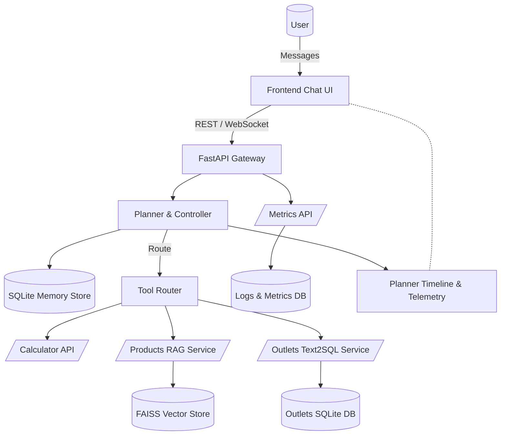
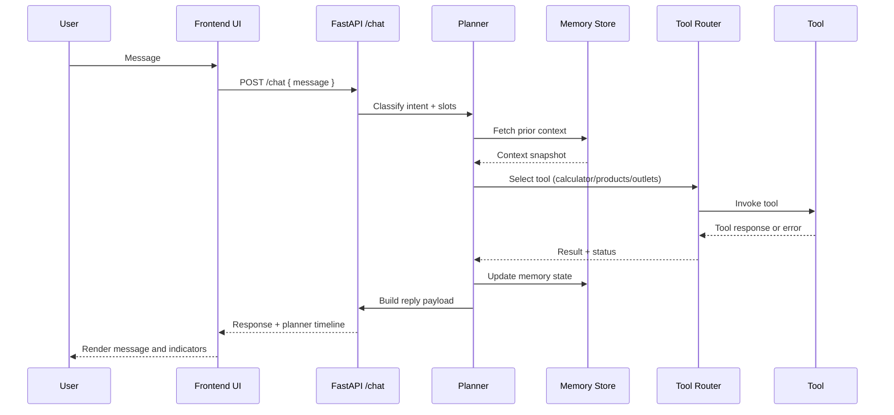

# 🧠 ZUS AI Assistant — Product Requirements

## Overview

ZUS AI Assistant is an intelligent, multi-tool conversational system designed to understand natural language queries, plan actions, call specialized APIs, and maintain sequential context across sessions. The assistant simulates a production-grade agent that reasons over user intent, selects the correct tools, persists memory across turns, and surfaces results through a rich chat interface while handling unhappy flows gracefully.

## Linked Artifacts

- `flows/sequential_conversation.json` — exported happy and interrupted flow traces for Part 1.
- `docs/planner_decisions.md` — planner decision write-up aligned with Part 2 requirements.
- `tests/README.md` — testing strategy covering happy-path and unhappy-path suites.
- `docs/diagrams/system-architecture.mmd` — high-level component map.
- `docs/diagrams/planner-sequence.mmd` — planner decision sequence diagram.

## Objectives

| Goal | Description |
| --- | --- |
| 🧩 Contextual conversation | Remember user context between turns. |
| 🧭 Intelligent planning | Map natural language to intents and tools. |
| ⚙️ Tool calling | Execute `/calculator`, `/products`, `/outlets`. |
| 📚 Knowledge retrieval | Retrieve factual info using a FAISS vector store (RAG). |
| 🧮 Database querying | Use Text2SQL for outlet-related questions. |
| 🚧 Error recovery | Gracefully handle failed tool calls and invalid inputs. |
| 📊 Observability | Provide metrics on latency, accuracy, and feedback. |
| 💬 Frontend UI | Real chat interface (React/Vue/HTML) — no Streamlit or Gradio. |

## System Architecture

### Backend (FastAPI)

- Core planner that classifies intents (LLM or rule-based policies).
- Memory manager persisting conversation context in SQLite.
- Tool router for:
  - `/calculator` — safe arithmetic evaluation.
  - `/products` — FAISS-backed RAG retrieval.
  - `/outlets` — Text2SQL over outlet database.
- Evaluator logging latency, feedback, and metrics to SQLite.
- `/metrics` endpoint exposing latency, success rate, and feedback ratios.

### Frontend (React / Vanilla JS)

- Real-time chat interface with message bubbles.
- Message list with avatars and timestamps.
- Threaded multi-turn display that groups related follow-up turns.
- Rich composer supporting multiline input, Enter-to-send, and Shift+Enter for newline.
- Tool-call indicators (for example, “⚙️ Calling /products…”).
- Memory visualization sidebar showing active slots and intents.
- LocalStorage persistence to survive refreshes.
- Quick command buttons `/calc`, `/products`, `/outlets`, `/reset` with autocomplete-as-you-type.
- Planner/tool timeline panel highlighting decisions, active tools, and outcomes.
- Unhappy-flow banners when fallback handlers trigger.
- Live refresh after each turn to reflect updated memory state.

### Implementation Highlights

- **Memory & Conversation State**: `backend/memory/`, replay flows in `flows/sequential_conversation.json`, unit coverage under `tests/conversation/`.
- **Planner & Controller**: `backend/planner/` rule sets and helper types paired with the narrative in `docs/planner_decisions.md`.
- **Tool Integrations**: `backend/tools/` modules wired through `backend/api/tools.py`, with transcripts captured in `docs/transcripts/*/`.
- **Retrieval & Text2SQL**: `scripts/ingest_products.py`, `backend/tools/products.py`, `backend/tools/outlets.py`, plus supporting prompts in `prompts/text2sql/`.
- **Error Handling & Resilience**: middleware in `backend/core/errors.py`, unhappy-flow specs in `tests/unhappy/`, and metrics collected via `backend/core/metrics.py`.
- **Frontend Experience**: React app under `frontend/` with planner timeline widgets, Zustand store, and Vite build setup.

## Architecture Diagrams

### High-Level Component Map

### Planner Decision Sequence

## Data Stores

| Purpose | Storage | Description |
| --- | --- | --- |
| Conversation memory | SQLite | Per-user message context and slots. |
| Vector store | FAISS (local) | Stores product embeddings for RAG. |
| Outlet info | SQLite | Queried via Text2SQL endpoints. |
| Logs & feedback | SQLite | Captures metrics, latency, and user feedback. |

## Data Ingestion & Sources

- `drinkware_products.json` generated from [ZUS Drinkware](https://shop.zuscoffee.com/) collection.
- Embeddings built through `scripts/ingest_products.py` using FAISS with OpenAI or `sentence-transformers` models.
- Outlet catalogue scraped from [ZUS Outlets (Kuala Lumpur & Selangor)](https://zuscoffee.com/category/store/kuala-lumpur-selangor/) into `outlets.db` via `scripts/sync_outlets.py` with schema `schema/outlets.sql`.
- Nightly GitHub Action refreshes both data stores, logs diffs, and records rebuild timestamps.
- `backend/openapi.yaml` documents `/products` and `/outlets` contracts, including error responses.

## Tool APIs

| Endpoint | Input | Output | Description |
| --- | --- | --- | --- |
| `/calculator` | Expression | Result | Evaluates math expressions safely. |
| `/products` | Query string | Product data | Uses FAISS to retrieve top-k results and summaries. |
| `/outlets` | Natural-language query | SQL result set | Text2SQL pipeline executes validated SQL. |
| `/chat` | `{ user_id, message }` | Bot reply | Orchestrates planner, memory, and tool routing. |
| `/metrics` | — | System metrics | Returns latency, success rate, feedback ratios. |

## Core Flow (Planner Logic)

1. User message enters planner.
2. Planner classifies intent and identifies missing slots.
3. Planner chooses an action:
   - Ask a follow-up question.
   - Invoke `/calculator`, `/products`, or `/outlets`.
   - Trigger fallback for unknown or malicious input.
4. Action executes, response recorded, memory updated, metrics logged.

### Example Flow

- **User**: “What’s the biggest tumbler?”
- **Planner**: Intent → `product_info`; missing slots resolved from context.
- **Tool**: Calls `/products`.
- **Memory**: Adds `product_type = tumbler`.
- **Response**: “Our biggest tumbler is the 500 ml Stainless model ☕.”

## Planner Decision Points

- **Tracked slots**: `topic`, `operation`, `location`, `time_range`, `product_type`, `loyalty_status`.
- **Decision loop**: classify intent → verify slots → choose tool (`/calculator`, `/products`, `/outlets`, or fallback).
- **Confidence guardrails**: request clarification when confidence < 0.6 or mandatory slots missing.
- **Post-action review**: validate tool output, append planner timeline event, update memory, record latency.
- **Interruption handling**: detect context switches, archive prior thread, spawn new thread while preserving history.

## Evaluation & Metrics

| Metric | Description |
| --- | --- |
| Intent accuracy | Percentage of correct planner predictions. |
| Tool success rate | Percentage of successful tool executions. |
| Average latency | Mean response time per turn. |
| Feedback ratio | 👍 versus 👎 user feedback. |
| Memory consistency | Rate of accurate context carryover across turns. |

## Frontend UX Summary

| Feature | Description |
| --- | --- |
| Chat UI | Modern bubble interface for bot and user messages. |
| Composer | Multiline input with Enter-to-send and Shift+Enter newline. |
| Tool indicators | Animated tags showing active API calls with success/failure status. |
| Memory sidebar | Optional panel displaying active slots and intents. |
| Quick buttons | `/calc`, `/products`, `/outlets`, `/reset` with autocomplete-as-you-type. |
| Typing animation | Three-dot indicator while backend processes requests. |
| Error display | Red alert bubble for fallback scenarios and degraded states. |
| Color palette | Background `#f8f5f2`, bot `#e0d4c1`, user `#b38b59`, accent `#573c2e`. |

## Constraints & Limitations

- No Streamlit, Gradio, or similar app builders for the UI.
- Must use React, Vue, or HTML + JS for the frontend experience.
- No secret keys committed to the repository.
- Solution runs offline with local FAISS and SQLite stores.
- Tool errors must degrade gracefully without crashing the system.

## Testing & QA

- `tests/conversation/` covers sequential happy paths, slot interruptions, and memory regression cases.
- `tests/tools/` validates calculator success/failure, `/products` retrieval quality, `/outlets` Text2SQL execution, and stores transcripts under `docs/transcripts/`.
- `tests/unhappy/` simulates missing parameters, forced HTTP 500 responses, and SQL injection attempts.
- Cypress end-to-end suite verifies planner timeline, tool indicators, unhappy-flow banners, and frontend persistence.
- GitHub Actions CI runs linting, unit, integration, and E2E suites on each push and nightly schedules, publishing artifacts with logs and coverage.

## Error Handling & Security Strategy

- Global FastAPI exception middleware maps errors to structured logs and friendly user messages.
- Calculator sanitizes expressions (operation whitelist, digit limits) and enforces short execution timeouts.
- `/products` enforces query rate limits, validates embedding inputs, and falls back to cached FAQs when the vector store is unavailable.
- `/outlets` parameterizes SQL, rejects malicious patterns, and replies with safe guidance.
- Circuit breaker retries tool calls with exponential backoff and surfaces “service unavailable” states to the UI.
- Frontend displays degraded-mode badges and prompts alternative phrasing when planner confidence drops.

## Transcripts & Replay Evidence

- `docs/transcripts/sequential/` — Part 1 happy and interrupted dialogue replays.
- `docs/transcripts/calculator/` — Part 3 success and graceful error flows.
- `docs/transcripts/products/` — RAG responses with top-k evidence and fallback handling.
- `docs/transcripts/outlets/` — Text2SQL executions, including SQL injection defense transcripts.
- `docs/transcripts/unhappy/` — Missing-parameter and downtime recovery scenarios across tools.
- Each transcript tags planner decisions, tool latency, and outcome codes for QA review.

## Deliverables

| Item | Description |
| --- | --- |
| `backend/` | FastAPI services, planner, tools, and RAG pipeline. |
| `frontend/` | React or Vanilla JS chat UI. |
| `db/` | SQLite databases and FAISS index assets. |
| `README.md` | Setup instructions, architecture overview, planner flowchart, testing commands. |
| `PRD.md` | This document. |
| `tests/` | Unit, integration, unhappy-flow, and E2E suites. |
| Deployment | Backend (Railway/Render) and frontend (Vercel/Netlify) configurations. |

## Deployment Checklist

- Public GitHub repository with secrets removed and OpenAPI spec committed.
- Hosted backend (Railway/Render or equivalent) and frontend (Vercel/Netlify or similar) documented in the README.
- README includes setup steps, environment variables, architecture overview, planner flow, testing commands, and deployment guidance.
- Documentation bundle ships with `backend/openapi.yaml`, planner decision write-up, exported diagrams, and success/failure transcripts.

## Success Criteria

- Fully functional end-to-end chat flow spanning all tools.
- Handles at least three unique tool types.
- Conversation memory persists per user session.
- Frontend reflects planner state, tool calls, and unhappy flows.
- System degrades gracefully on errors, downtime, or malicious payloads.
- Codebase remains modular, documented, and deployable.
